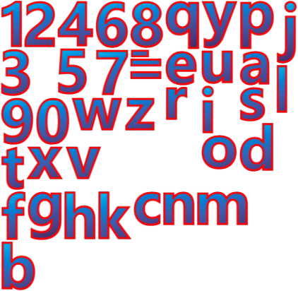

# TextImageGenerator

## 预览地址

推荐使用最新版chrome预览，[点击跳转](http://krapnik.cn/TextImageGenerator/)

## 使用说明
TextImageGenerator是一款十分方便使用的在线文字生成图片工具，可以对文字的属性进行各种搭配混合调整至特定效果，所见即所得。主要利用浏览器渲染引擎对文字+CSS样式进行设置，通过svg标签转换成图片成品，支持将文字导出成Bitmap Font，并支持汉字拼音模式。

## 应用场景
 - 直接生成图片
    
 - 生成带拼音音标的位图
    
 - 生成BitmapFont
    
 - and More~

## 即将支持的功能

### 内容设置

#### 基础设置
 - [ ] 增加坐标调整文字位置
 - [ ] 增加文字透明度设置

#### 高级设置
 - [ ] 增加filter设置(filter-css-generator)[https://cssgenerator.org/filter-css-generator.html]
 - [ ] 增加Transform设置(transform-css-generator)[https://cssgenerator.org/transform-css-generator.html]

#### 背景管理
 - [ ] 补全background的属性：background-origin、background-position、background-repeat、background-size，和background-attachment设置
 - [ ] 增加background-blend-mode

#### 字体管理
 - [ ] 增加对字体列表进行增删查改
 - [ ] 增加对远程字体的(@font-face)[https://developer.mozilla.org/zh-CN/docs/Learn/CSS/Styling_text/Web_fonts]的支持
 - [ ] 增加对已安装字体手动添加的支持

#### 注音模式
 - [ ] 旁注音增加英语单词音标转换
 - [ ] 旁注音增加日语转换(kuroshiro)[https://github.com/hexenq/kuroshiro]

### 高级设置 
- [ ] 增加样式强制最高级
- [ ] 增加预设样式

### 预览设置 
- [ ] 内容清空

### 导出设置
- [ ] 图片质量设置
- [ ] Bitmap Font高级配置
- [ ] 配置导出&导入
